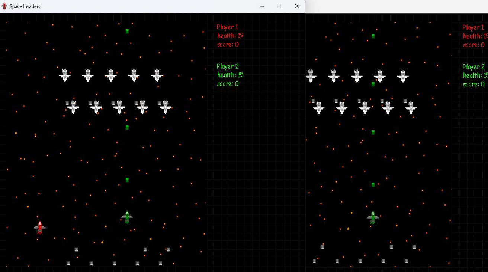

# Space Invaders Multi Demo
Simple Space Invaders Multi game proof of concept.




### PyGame
Python Library used for graphic rendering.

### Socket
Python Library used for client-server connection.

# Setup project

### Download - Clone repository
```
git clone git@github.com:WojciechWlo/Space_Invaders_Multi.git
```

### Installing requirements
Preferred way with using virtual environment:
```
python -m virtualenv venv
```

Next We have to activate it:
```
cd venv
cd scripts
.\activate
cd ..
cd ..
```

Now We can install requirements contained in requirements.txt:
```
pip3 install -r requirements.txt
```

### Server launching
To set up server we have to activate virtual environment and launch server.py
```
python server.py
```

We can also set additional settings:
*-n - Allowed clients number (default 2)
*-a - Host IP adress (default 127.0.0.1)
*-p - Host port (default 12345)

For example:
```
python server.py -n 3 -a 127.0.0.1 -p 12345 
```

### Joining as client
In settings.json We can set player nickname and host IP address and port (IP address and port should match these used in server launching).

To set up server we have to activate virtual environment and launch main.py:
```
python main.py
```

### Connecting with several devices
Devices using server and clients may be connected by programs offering VLAN such as Log Main Hamachi.
After setting VLAN between server and clients, We should adjust server IP address and port.

Example setting:
```
python server.py -n 3 -a 0.0.0.0 -p 8080 
```

Users should use the same settings in settings.json.

The last step is to launch server and to join as clients.

Note: You may need to disable the server-side firewall.

# Comments and observations
The project was created with the idea of ​​creating a simple game for many players. Unfortunately, it does not contain any specific mechanisms to stabilize the connection between clients and the server, as a result of which the game may not work stably. The project itself may constitute a reference point for future, more advanced projects.